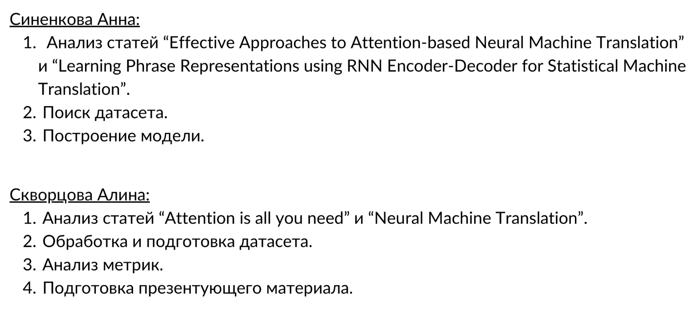

# Нейромашинной перевод

**Постановка задачи:** написать рекурентную нейронную сеть для машинного перевода с русского языка на английский.

**Результаты:** в качестве датасета была выбрана коллекция параллельных текстов Anki (https://www.manythings.org/anki/). Архитектура сети была взята из статьи https://arxiv.org/abs/1508.04025v5. Сеть обучалась на 25 эпохах. Примеры перевода приведены в блокноте.

**Распределение ролей:** 

